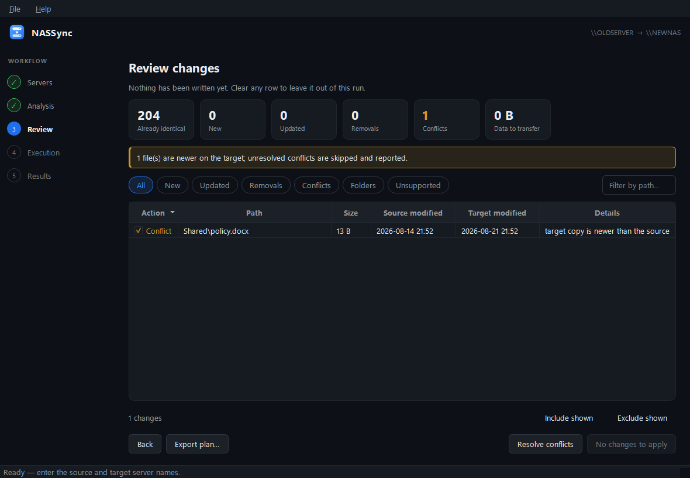
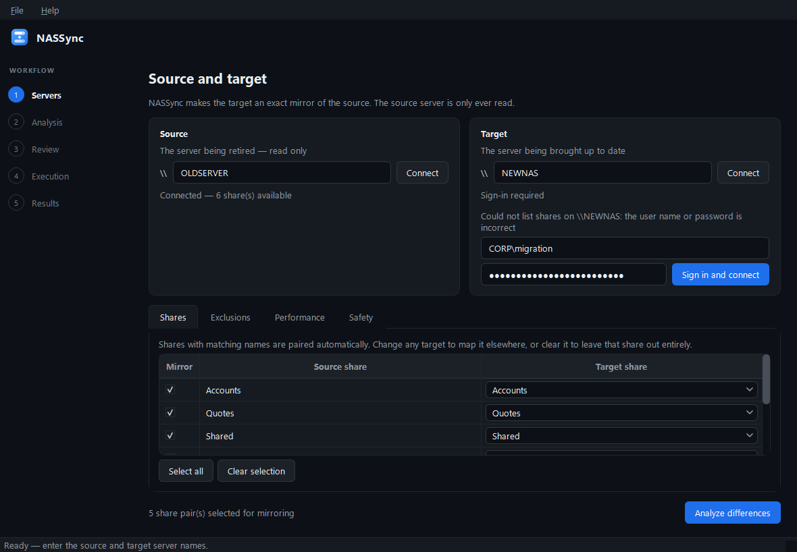
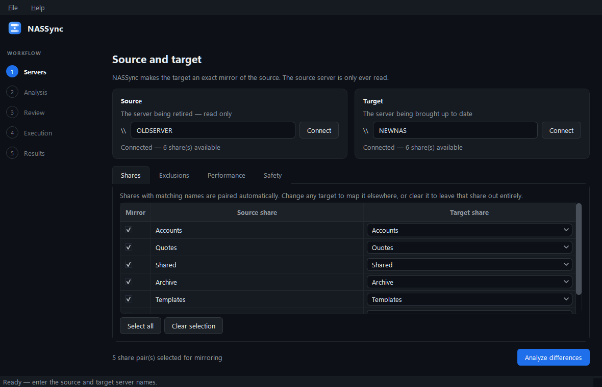
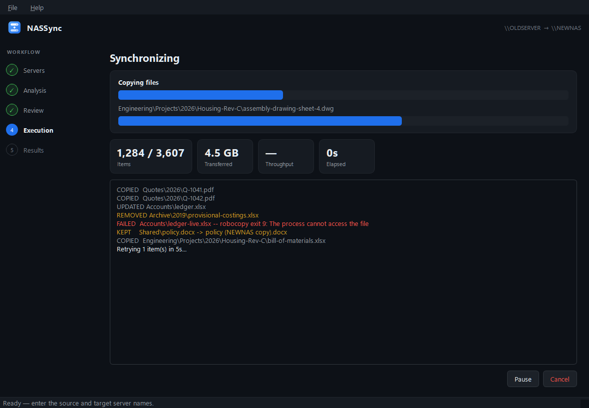
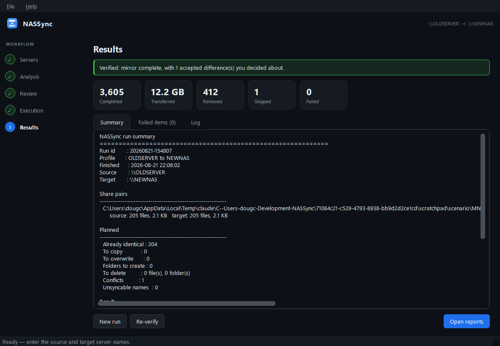

# NASSync

A Windows desktop tool for the last mile of a file server migration: making a
new SMB file server an **exact mirror** of the old one, so the old one can be
switched off with confidence.

<br clear="left">


It is built for the situation where you bulk-copied a snapshot some time ago and
now need to catch up everything that changed since — new files, edited files,
renames, deletions — without guessing and without a command line.



## What it does

- Connects to a source and a target server and lists their shares live
- Pairs shares up automatically by name, and lets you remap any of them
- Scans both trees and shows you **exactly** what it intends to do — before
  anything is written
- Copies new and changed files, creates missing folders, and removes anything on
  the target that no longer exists on the source
- Stops and asks about the one case it should never guess: a file that is
  **newer on the target** than on the source
- Verifies the result afterwards and writes a report you can keep as evidence

The source server is only ever read. NASSync never writes to it.

## Safety model

Mirroring deletes things, so the destructive half is deliberately hard to
trigger by accident:

| Guard | What it does |
|---|---|
| Preview first | Nothing is written until you review the plan and press Start. Any row can be unticked. |
| Trash, not deletion | Deleted items are moved to `.nassync-trash\<run id>\` on the target, keeping their relative path. Recoverable until you empty it. |
| Conflicts are never guessed | A file newer on the target usually means somebody has started working on the new server. Default is to skip it and report it. |
| Confirmation | A dialog states the number of overwrites and deletions before the run starts. |
| Journalled | Every outcome is written to disk as it happens, so an interrupted run resumes instead of restarting. |
| Verified | An optional post-run rescan proves the two sides match. |

## How it decides

Files are compared by **size and modified-time**, with a tolerance (default 2
seconds) because filesystems disagree about timestamps. Content is not hashed —
across two SMB servers that would take days and change nothing.

| State | Action |
|---|---|
| On source, missing on target | Copy |
| Both, source newer or size differs | Overwrite |
| Both, target newer | **Conflict** — you decide |
| Both, matching within tolerance | Counted as identical, not listed |
| On target, missing on source | Delete (to trash) |
| Folder on target, missing on source | Delete recursively, listed as one row |
| Matches an exclusion rule | Ignored on both sides — never copied, never deleted |

A rename on the source is indistinguishable from a delete plus a create, so it
correctly appears as both: the new name is copied, the old name is removed.

## Exclusions

Excluded items are ignored on **both** servers — never copied, and never
removed from the target. There are two kinds of pattern:

| Pattern | Meaning |
|---|---|
| `@Recycle`, `Thumbs.db`, `*.tmp` | **Name pattern.** Matches that file or folder name at any depth. A matching folder is never descended into, so its whole subtree is skipped. |
| `Archive\2019`, `\@Recycle`, `Projects\*\temp` | **Path pattern.** Anchored at the share root; matches one specific folder plus everything inside it. Use this to exclude a particular folder rather than every folder that happens to share its name. |

Wildcards work in both. Matching is case-insensitive.

Defaults cover the recycle bins and metadata folders that NAS appliances keep
at the root of every share, which are otherwise easy to miss:

- **QNAP** — `@Recycle`, `@Recently-Snapshot`, `@Transcode`, `.@__thumb`
- **Synology** — `#recycle`, `@eaDir`, `#snapshot`
- **Windows** — `$RECYCLE.BIN`, `System Volume Information`, `Thumbs.db`, `desktop.ini`
- **macOS** — `.DS_Store`, `.Trash*`, `._*`
- **Applications** — `~$*`, `*.tmp`
- **NASSync's own** — `.nassync-trash`

## Performance

Copying is done by robocopy, tuned on the Performance tab:

| Setting | Default | Effect |
|---|---|---|
| Parallel streams per folder | 16 | robocopy `/MT`. SMB spends most of its time waiting on per-file round trips, so overlapping them is where nearly all the throughput comes from. |
| Folders copied at once | 3 | `/MT` only parallelises within one robocopy call, so this covers a delta spread thinly across many folders. |
| Unbuffered I/O for large files | on | robocopy `/J` — avoids filling the system cache with data read exactly once. |
| Restartable mode | **off** | robocopy `/Z`. Lets an interrupted file resume rather than restart, but journals every block and is by far the biggest throughput cost. Enable only for a link that genuinely drops mid-transfer. |

If the target NAS struggles under load, reduce the two figures before changing
anything else.

## Requirements

- Windows (the copy engine is `robocopy`, and share enumeration uses `netapi32`)
- Python 3.11+
- An account with access to both servers — see [Credentials](#credentials)

## Credentials

NASSync uses whatever credentials Windows already holds, which on a domain
workstation is usually all that is needed. If a server refuses the connection
*for who you are* — wrong account, no session, expired password — username and
password fields appear inline on that server's card:



Failures that a password could not fix (server offline, name wrong, Server
service stopped) show an ordinary error instead, rather than implying the
credentials were at fault.

How the password is handled:

- Passed straight to `WNetAddConnection2` — the API behind `net use` — and
  **never stored, logged, written to a profile, or included in a report**
- The session is created **without** `CONNECT_UPDATE_PROFILE`, so Windows does
  not persist it: it lasts for the current logon session and is gone at sign
  out. NASSync writes no credential to disk, ever.
- The field is cleared the moment the connection succeeds
- Everything afterwards — enumeration, scanning, and robocopy in its own
  process — travels over that session without needing the password again

If Windows already holds a *different* session to that server, NASSync drops it
and retries once, without forcing: if something else has files open there, it
says so rather than yanking the connection away.

## Install and run

```sh
git clone <your-fork-url> NASSync
cd NASSync
python -m venv .venv
.venv\Scripts\activate
pip install -r requirements.txt

python -m nassync
```



## Command line

The engine works without the GUI, which is useful for scripting and for seeing
what a run would do from a terminal:

```sh
python -m nassync shares OLDSERVER                     # list a server's shares
python -m nassync plan   --source \\OLDSERVER\Data --target \\NEWNAS\Data
python -m nassync run    --source \\OLDSERVER\Data --target \\NEWNAS\Data --yes
python -m nassync verify --profile "Migration"
python -m nassync runs                                 # list previous runs
```

`--source` and `--target` also accept ordinary local directories, which is how
the test suite drives it — handy for trying NASSync out on two throwaway folders
before pointing it at real servers.

## Profiles, reports, and resuming

Everything lives under `%LOCALAPPDATA%\NASSync`:

- `profiles\` — saved server pairs, share mappings, exclusions and options, so a
  second pass is reopen-and-rescan
- `runs\` — per-run journals (`plan.json` plus an appended `progress.jsonl`)
  that make **File → Resume an interrupted run** possible
- `reports\<run id>\` — `plan.csv`, `results.csv`, `summary.txt` and
  `nassync.log` for each run





## Known limitations

- **No permissions are copied.** NASSync copies data, attributes and timestamps
  (`robocopy /COPY:DAT`). It was written for Linux-based NAS targets, where NTFS
  ACLs cannot survive the trip anyway — configure permissions on the target
  server itself.
- **Symbolic links and reparse points are skipped** and reported, rather than
  followed, to avoid copy loops.
- **Names that are legal on Linux but not on Windows** (trailing dots or spaces,
  reserved names like `CON`, characters such as `:`) cannot be copied through
  Windows. They are listed explicitly as "cannot sync" rather than silently
  dropped, so you can deal with them by hand.
- **Files open at the time of the run** are retried, then listed as failures you
  can retry in bulk or abandon. For a final cutover pass, lock users out first.
- Long paths (>260 characters) are handled, but a Windows client is still the
  bottleneck for anything pathological.

## Tests

```sh
python -m unittest discover -s tests -t .
```

The planner tests cover the comparison rules against real directory trees; the
executor tests run the real `robocopy` against temporary folders and check
copying, trashing, and conflict resolution end to end.

## Licence

MIT — see [LICENSE](LICENSE).
